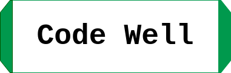

# Welcome to Code Well

## Table of contents

- [Welcome to Code Well](#welcome-to-code-well)
  - [Table of contents](#table-of-contents)
  - [What is this?](#what-is-this)
  - [Who I am?](#who-i-am)
  - [What I am doing?](#what-i-am-doing)
  - [What is this project about?](#what-is-this-project-about)
  - [What is the purpose of this project?](#what-is-the-purpose-of-this-project)
  - [Usage](#usage)
  - [Contributing](#contributing)
  - [License](#license)

## What is this?

This is a repository for the Code Well project.

## Who I am?

I am a software engineer student at ALX. I am from
Kenya and I am 21 years old.

## What I am doing?

I am learning Software Engineering at ALX. I am
currently working on the Code Well project.

## What is this project about?

This project is about using the skills I have learned
so far to build a website. The website will be a
web service that will allow users to share on their
repositories and projects. It will also allow users
to share their ideas and collaborate with other users.
And similarly, users will be able to manage their
task and set daily goals.
Articles related to the well being of software
engineers will also be shared on the website.
The blog will be a place where users can share
their experiences and ideas.

## What is the purpose of this project?

The purpose of this project is to meet the ALX
Software Engineering portfolio requirements and
complete the foundation level of the ALX Software
Engineering programming.

## Project url

The project is hosted on GitHub. You can visit
the project by clicking on the link below.

- [Code Well](https://www.blissprism.tech)

## Usage

To use this project, you need to have a web browser
installed on your computer. You can use any web
browser of your choice. You can use Google Chrome,
Mozilla Firefox, Microsoft Edge, Safari, Opera, etc.

## Contributing

To contribute to this project, you need to have
a GitHub account. You can create a GitHub account
by visiting the GitHub website. You can also
contribute to this project by forking it and
creating a pull request.

## License

This project is free to use. You can use it for
personal and commercial purposes. You can also
use it for educational purposes. You can also
use it for research purposes. You can also
use it for study purposes.

## Contact

You can contact me by sending me an email at:

- [Email](<ed127720@students.mu.ac.ke>)
- [Phone](+254712345678)
- [Twitter](https://twitter.com/AchitraJacobs)
- [LinkedIn](https://www.linkedin.com/in/jacob-obara-2b9b8522a/)
